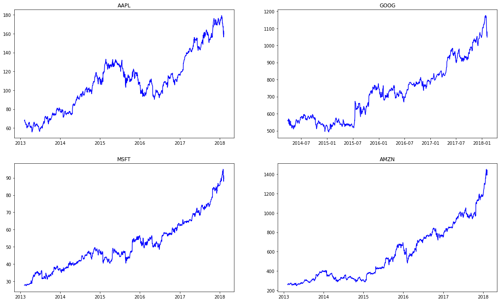
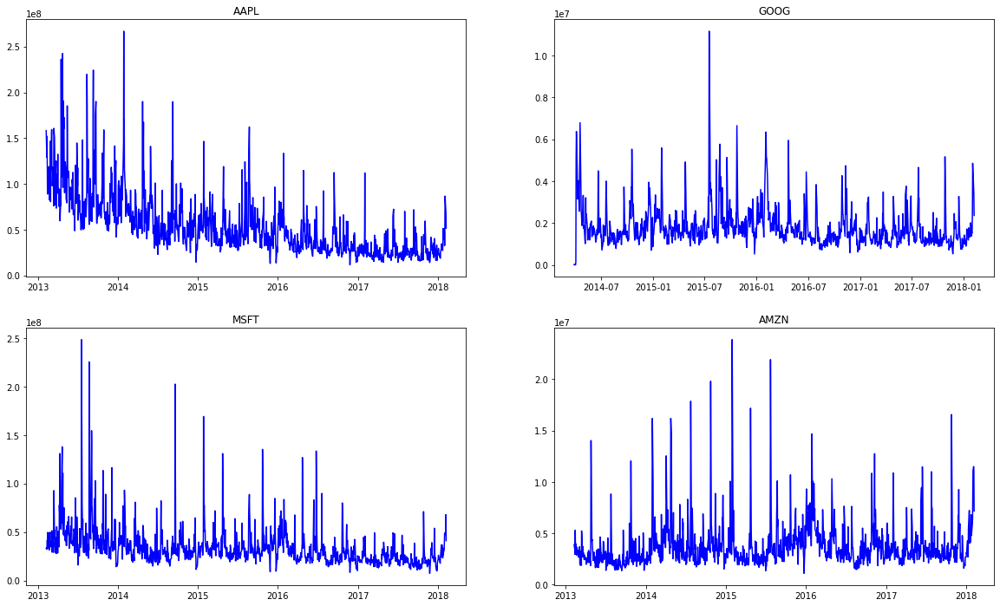
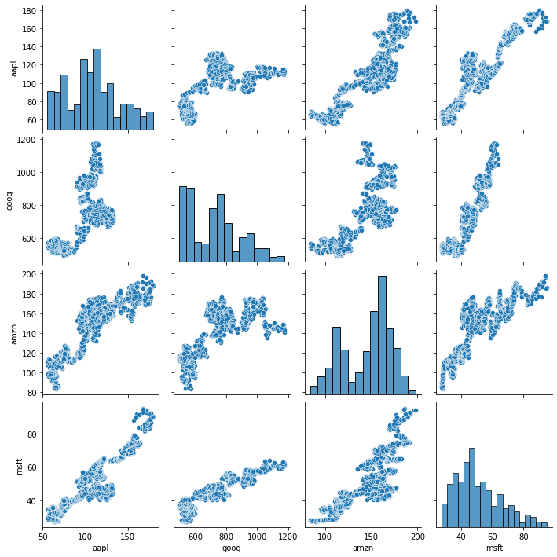
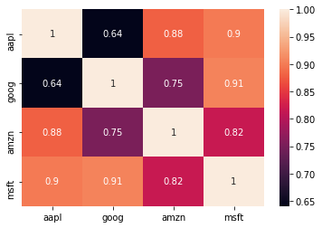
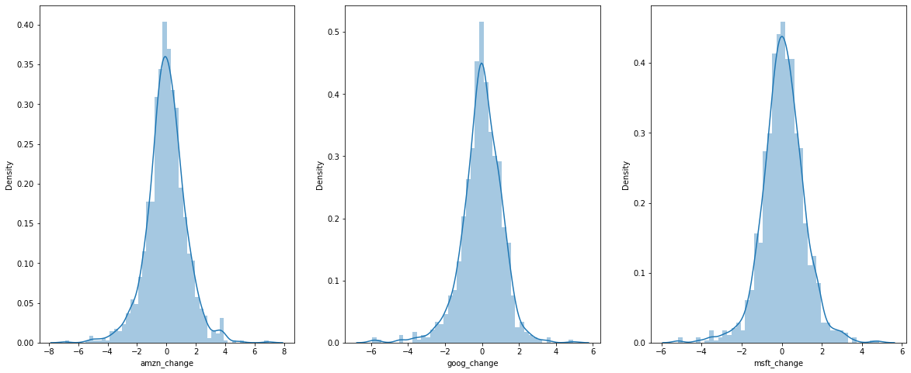

# Stock-Price-Analysis

## Description

It is a Data Analysis based on Time Series in which I have taken stock prices of the world 4 leading MNC's Google, Microsoft, Amazon, Apple.
I have analyzed the several data like:
1. Closing Price
2. Volume
3. Daily Stock Return
4. Correlation
5. Value at Risk Analysis

## Plots

Closing Price

Volume

Pair plot for Stock Prices

Co-relation plot for stock prices

Distribution plot

## Technologies used

1. Pandas, Numpy for Data processing 
2. Seaborn, Matplotlib, Plotly for Data Visulization.
